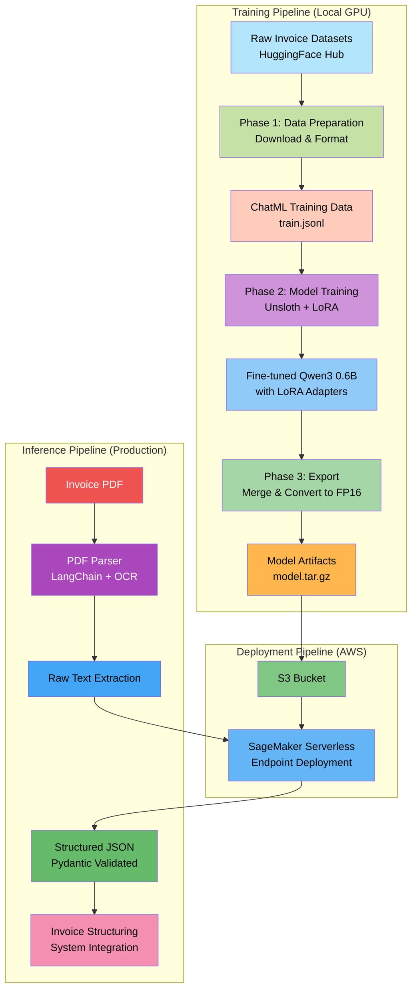
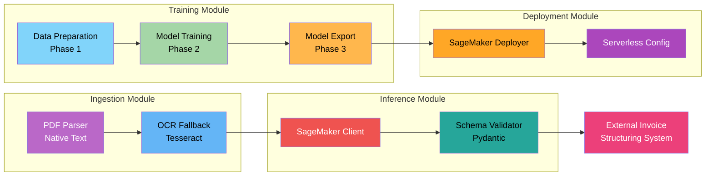
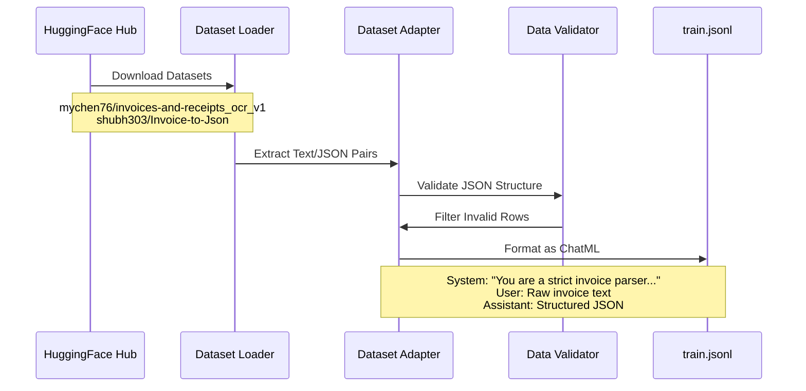
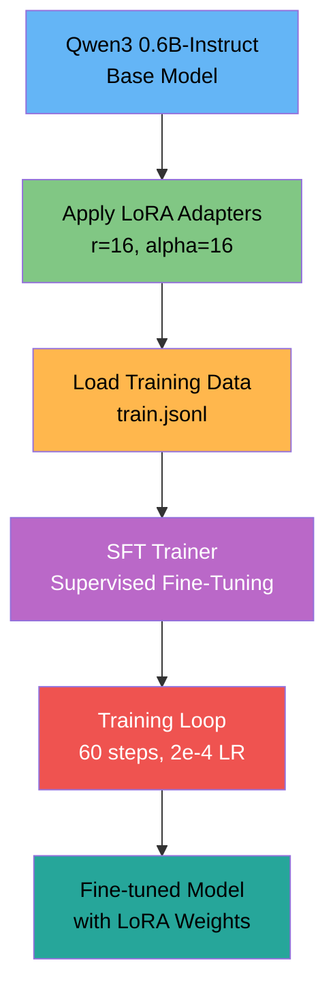
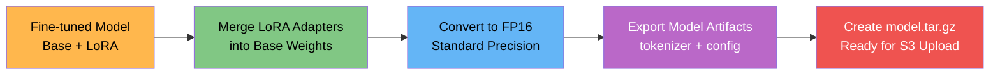
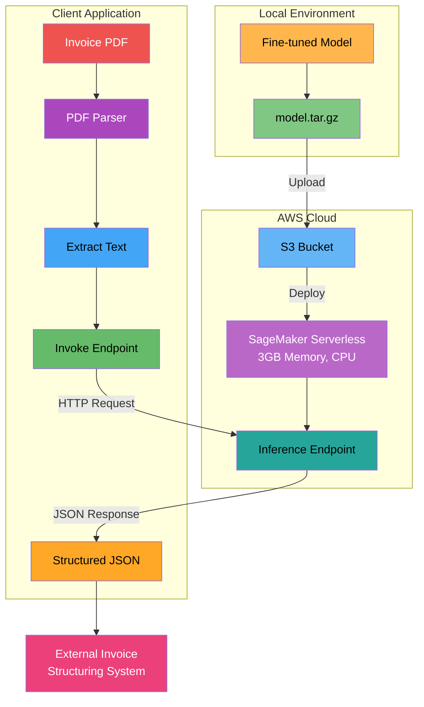
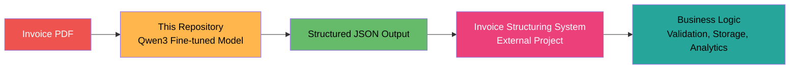

# Qwen3 Invoice Extractor

> **Fine-tune a Small Language Model (SLM) for high-precision invoice extraction and structuring**

This repository provides a complete pipeline for fine-tuning **Qwen3 0.6B-Instruct**, a state-of-the-art Small Language Model, to extract structured data from invoices. The fine-tuned model is designed to support another project focused on invoice structuring and processing.

## 🎯 Purpose

This project fine-tunes a lightweight SLM (Small Language Model) to convert unstructured invoice text into structured JSON. The model is optimized for:

- **High accuracy** (target: 99%+) on invoice extraction tasks
- **Cost-effective deployment** on serverless infrastructure
- **Small model size** (<1GB) for fast inference
- **Structured output** that integrates seamlessly with invoice processing systems

The fine-tuned model serves as a critical component in a larger invoice structuring pipeline, enabling automated extraction of key fields like invoice numbers, dates, vendors, line items, and totals.

## 🏗️ Architecture Overview



## 📊 System Components



## 🔄 Training Pipeline (3 Phases)

### Phase 1: Data Preparation

Downloads and formats invoice datasets from HuggingFace Hub into ChatML format.



**Key Features:**
- Downloads multiple invoice datasets from HuggingFace Hub
- Adapts different dataset formats to unified ChatML structure
- Validates JSON output quality
- Filters invalid or corrupted examples
- Outputs standardized `train.jsonl` file

### Phase 2: Model Training

Fine-tunes Qwen3 0.6B using Unsloth and LoRA (Low-Rank Adaptation).



**Training Configuration:**
- **Model**: Qwen3 0.6B-Instruct (released April 2025)
- **Method**: LoRA (Low-Rank Adaptation) with r=16
- **Quantization**: 4-bit during training (saves VRAM)
- **Sequence Length**: 2048 tokens
- **Training Steps**: 60 (fast convergence with Unsloth)
- **Hardware**: Local GPU with 16GB VRAM

### Phase 3: Model Export

Merges LoRA adapters into the base model and exports in FP16 format for SageMaker.



**Export Details:**
- Merges LoRA weights into base model (no separate adapter files)
- Converts to FP16 for CPU inference compatibility
- Packages model, tokenizer, and configuration
- Creates tarball for SageMaker deployment

## 🚀 Deployment Architecture



## 📦 Project Structure

```
qwen3-invoice-extractor/
├── src/
│   ├── training/           # Training pipeline (3 phases)
│   │   ├── phases/
│   │   │   ├── phase1_data_preparation.py
│   │   │   ├── phase2_model_training.py
│   │   │   └── phase3_export.py
│   │   ├── configs/       # Training & dataset configs
│   │   └── utils/         # Prompt formatting, validation
│   ├── ingestion/         # PDF parsing (LangChain + OCR)
│   ├── inference/         # SageMaker client & schema
│   └── deployment/        # SageMaker deployment scripts
├── scripts/
│   └── prepare_data.py    # CLI for data preparation
├── data/
│   └── train.jsonl        # Generated training data
└── docs/                  # Additional documentation
```

## 🛠️ Quick Start

### Prerequisites

- Python 3.12+
- Local GPU with 16GB VRAM (for training)
- AWS Account (for deployment)
- HuggingFace account (for dataset access)

### Installation

```bash
# Install dependencies
uv sync

# Install training dependencies (requires GPU)
uv sync --extra training
```

### Training Pipeline

```bash
# Phase 1: Prepare training data
python -m scripts.prepare_data --output data/train.jsonl

# Phase 2: Train the model (requires GPU)
python -m src.training.phases.phase2_model_training

# Phase 3: Export model for deployment
python -m src.training.phases.phase3_export
```

### Deployment

```bash
# Upload model to S3
aws s3 cp model.tar.gz s3://your-bucket/models/

# Deploy to SageMaker Serverless
python -m src.deployment.sagemaker_deployer
```

## 🔗 Integration with Invoice Structuring System

The fine-tuned model is designed to integrate with a larger invoice structuring and processing system:



**Output Schema:**
```json
{
  "invoice_number": "INV-2024-001",
  "date": "2024-01-15",
  "vendor": "Acme Corporation",
  "total_amount": 1250.00,
  "line_items": [...],
  "tax": 100.00
}
```

The extracted structured data is validated using Pydantic schemas and can be directly consumed by downstream invoice processing workflows.

## 📈 Model Specifications

| Component | Specification |
|-----------|--------------|
| **Base Model** | Qwen3 0.6B-Instruct |
| **Model Size** | ~600M parameters, <1GB on disk |
| **Training Method** | LoRA (r=16, alpha=16) |
| **Quantization** | 4-bit during training, FP16 for inference |
| **Sequence Length** | 2048 tokens |
| **Deployment** | SageMaker Serverless (3GB memory) |
| **Inference Cost** | ~$0.00006/second |
| **Target Accuracy** | 99%+ on invoice extraction |

## 🧪 Data Sources

The model is trained on curated invoice datasets from HuggingFace Hub:

1. **mychen76/invoices-and-receipts_ocr_v1**
   - OCR text from real invoices
   - Structured JSON ground truth
   - Teaches model to handle OCR noise

2. **shubh303/Invoice-to-Json**
   - Question/answer format
   - Varied invoice layouts
   - Teaches model robustness

## 📝 License

See LICENSE file for details.

## 🙏 Acknowledgments

- **Qwen Team** for the Qwen3 model
- **Unsloth** for efficient fine-tuning framework
- **HuggingFace** for datasets and infrastructure

---

**Note**: This repository focuses solely on fine-tuning the SLM for invoice extraction. The fine-tuned model is intended to be used as a component in a larger invoice structuring and processing system.
